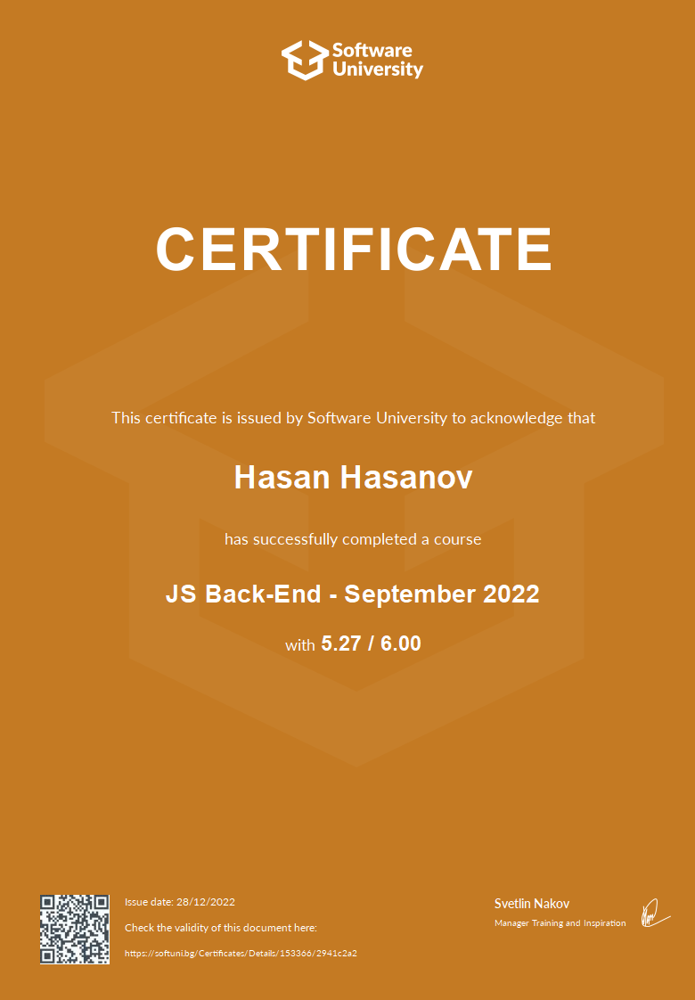

# Softuni-JS-Backend

• Introduction to Node.js;
• Event Loop;
• Modules;
• Request and Response Wrapper;
• Node.js Web Server.

• Streams;
• Pub/Sub Pattern;
• Events;
• FS Module;
• Debugging.

• Express;
• View Engines (handlebars).

• Relational and Non-Relational;
• MongoDB and Mongoose Overview;
• Mongoose Models;
• CRUD with Mongoose;
• Mongoose Querying.

• Cookies and Sessions;
• Authentication Concepts;
• JSON Web Token.

• Validation (why and how, mongoose validation);
• Error Handling.

• What is REST and RESTful services?;
• Setup Express.js REST API;
• CORS;
• Authentication with JWT;
• Error Handling and Validation.

